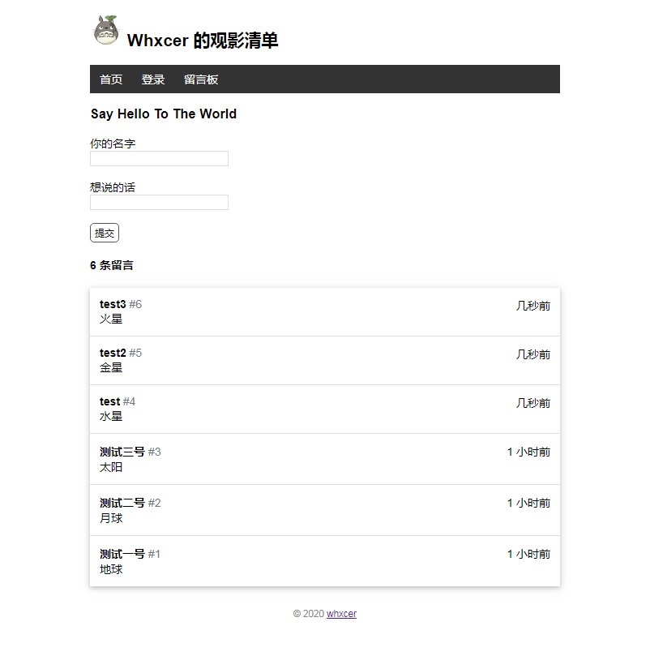

# Watchlist

使用 Flask 完成的简易电影列表项目以及留言板

Demo: http://whxcer2.pythonanywhere.com

## 项目截图

电影列表主页:



留言板页:


## 项目功能

游客权限:
- 查看 Watchlist 的列表
- 在留言板留言

管理员权限:
- 查看 Watchlist 的列表
- 在留言板留言
- 登录登出
- 对 Watchlist 的添加、修改、删除
- 修改显示的用户名


## 项目结构
```bash
├── watchlist                     # 项目包文件
│   ├── static                    # 静态文件
│   ├── templates                 # 视图模板
│   ├── __init__.py               # 包构造文件，创建程序实例
│   ├── commands.py               # 命令函数
│   ├── errors.py                 # 错误处理函数
│   ├── models.py                 # 模型类
│   └── routes.py                 # 视图函数
├── .flaskenv                     # 开发环境设置
├── requirements.txt              # 环境依赖包
├── test_watchlist.py             # 单元测试
└── wsgi.py                       # 手动设置环境变量并导入程序实例
```


## 项目运行

```bash
# 克隆项目
$ git clone https://github.com/wtraceback/Watchlist.git
# 切换至目录
$ cd Watchlist
# 安装虚拟环境
$ python -m venv env
# 启动虚拟环境
$ env\Scripts\activate
# 安装依赖
$ pip install -r requirements.txt
# 初始化数据库
$ flask initdb
$ flask forge
$ flask admin
# 运行项目
$ flask run
```


### 命令行

自定义命令:
- 创建数据库以及数据库表：  `flask initdb`
- 填充测试虚拟数据：        `flask forge`
- 添加管理员账户：          `flask admin`


## 参考

- 基础部分参考于此： [HelloFlask](https://read.helloflask.com/)
